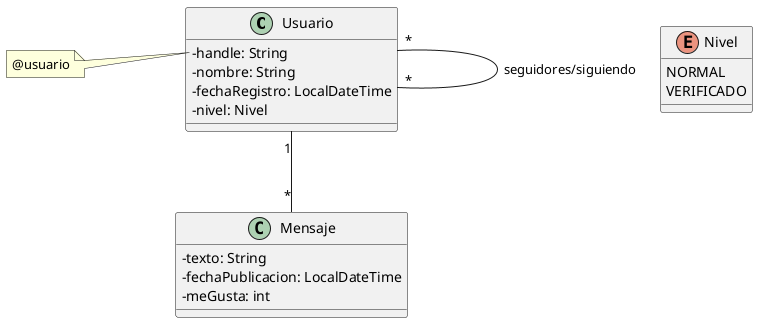

# Turuter

Te han contratado para crear Turuter, una nueva red social de mensajes cortos, y te han proporcionado el siguiente
diagrama de clases con la estructura interna que tendrá la aplicación:



La aplicación dispone de un menú como este:

```plaintext
-------------- Turuter --------------
-------------------------------------
Sesión iniciada como: @pruebas
-------------------------------------
1. Nuevo usuario 
2. Iniciar sesión o cambiar de usuario
3. Publicar mensaje 
4. Seguir a otro usuario 
5. Dar un "like" a un mensaje de otro usuario
6. Ver los mensajes de hoy de usuarios a los que sigues
7. Mostrar el número de seguidores y "likes" de la cuenta actual 
8. Ver todos los usuarios y sus seguidores (ordenados por handle y destacando los verificados)
9. Mostrar los 5 usuarios con más seguidores
0. Salir

Opción: 
```

## Sugerencias

- A la hora de preguntar por un usuario concreto, en vez de mostrar todos y elegir, se puede pedir el _handle_.

## Restricciones

- El _handle_ es un texto sin espacios y único (no puede haber dos usuarios que tengan el mismo).
- El número de usuarios y mensajes es ilimitado.
- El programa no termina hasta que se elija la opción de salir.
- Es obligatorio tratar las posibles excepciones de forma adecuada.
